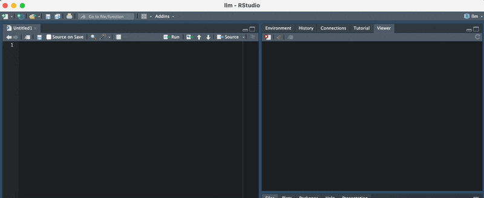

# chattr

<!-- badges: start -->

[](https://github.com/edgararuiz/chattr/actions/workflows/R-CMD-check.yaml)
[](https://app.codecov.io/gh/edgararuiz/chattr?branch=main)
[](https://CRAN.R-project.org/package=chattr)
[](https://lifecycle.r-lib.org/articles/stages.html#experimental)



<!-- badges: end -->
<!-- toc: start -->

-   [Install](#install)
-   [Getting Started](#getting-started)
    -   [Secret key](#secret-key)
    -   [Test connection](#test-connection)
-   [Using](#using)
    -   [The App](#the-app)
    -   [Keyboard Shortcut](#keyboard-shortcut)
-   [How it works](#how-it-works)
    -   [Prompt defaults](#prompt-defaults)
-   [Appendix](#appendix)
    -   [How to setup the keyboard
        shortcut](#how-to-setup-the-keyboard-shortcut)

<!-- toc: end -->

## Install

Since this is a very early version of the package, you can either clone
the repo, or install the package from GH:

``` r
remotes::install_github("edgararuiz/chattr")
```

## Getting Started

### Secret key

OpenAI requires a **secret key** to authenticate your user. It is
required for any application non-OpenAI application, such as `chattr`,
to have one in order to function. A key is a long alphanumeric sequence.
The sequence is created in the OpenAI portal. To obtain your **secret
key**, follow this link: [OpenAI API
Keys](https://platform.openai.com/account/api-keys)

By default, `chattr` will look for the **secret key** inside the a
Environment Variable called `OPENAI_API_KEY`. Other packages that
integrate with OpenAI use the same variable name.

Use `Sys.setenv()` to set the variable. The downside of using this
method is that the variable will only be available during the current R
session:

``` r
Sys.setenv("OPENAI_API_KEY" = "####################")
```

A preferred method is to save the secret key to the `.Renviron` file.
This way, there is no need to load the environment variable every time
you start a new R session. The `.Renviron` file is available in your
home directory. Here is an example of the entry:

    OPENAI_API_KEY=####################

### Test connection

Use the `chattr_test()` function to confirm that your connection works:

``` r
chattr_test()
✔ Connection with OpenAI cofirmed
✔ Access to models confirmed
```

## Using

### The App

The main way to use `chattr` is through the Shiny Gadget app. By
default, it runs inside the Viewer pane. The fastest way to activate the
app is by calling it via the provided function:

``` r
chattr::chattr_app()
```


A lot of effort was put in to make the app’s appearance as close as
possible to the IDE. This way it feels more integrated with your work
space. This includes switching the color scheme based on the current
RStudio theme being light, or dark.

Automatically, the app will automatically add buttons to each code
section. The buttons lets us copy the code to the clipboard, or to send
it to the document. If you [“call”](#keyboard-shortcut) the app from a
Quarto document, the app will envelop the code inside a chunk.

### Keyboard Shortcut

The best way to access `chattr`’s app is by setting up a keyboard
shortcut for it. This package includes an RStudio Addin that gives us
direct access to the app, which in turn, allows a **keyboard shortcut**
to be assigned to the addin. The name of the addin is: “Open Chat”. If
you are not familiar with how to assign a keyboard shortcut to the
adding see the Appendix section: [How to setup the keyboard
shortcut](#how-to-setup-the-keyboard-shortcut).

## How it works


`chattr` enriches your request with additional instructions, name and
structure of data frames currently in your environment, the path for the
data files in your working directory. If supported by the model,
`chattr` will include the current chat history.

To see what `chattr` will send to the model, set the `preview` argument
to `TRUE`:

``` r
library(chattr)

data(mtcars)
data(iris)

chattr(preview = TRUE)
```

    ── chattr ──────────────────────────────────────────────────────────────────────

    ── Preview for: Console 

    • Provider: Open AI

    • Model: GPT 3.5 Turbo

    • temperature: 0.01

    • max_tokens: 1000

    • stream: TRUE

    ── Prompt: 

    role: system

    content: You are a helpful coding assistant

    role: user

    content:

    * Use the 'Tidy Modeling with R' (https://www.tmwr.org/) book as main reference

    * Use the 'R for Data Science' (https://r4ds.had.co.nz/) book as main reference

    * Use tidyverse packages: readr, ggplot2, dplyr, tidyr

    * For models, use tidymodels packages: recipes, parsnip, yardstick, workflows,
    broom

    * Avoid explanations unless requested by user, expecting code only

    * Data files available:

    |- inst/prompt/base.txt

    * Data frames currently in R memory (and columns):

    |-- iris (Sepal.Length, Sepal.Width, Petal.Length, Petal.Width, Species)

    |-- mtcars (mpg, cyl, disp, hp, drat, wt, qsec, vs, am, gear, carb)

    [Your future prompt goes here]

### Prompt defaults

To edit what `chattr` is sending to the model you can use
`ch_defaults()`:

``` r
ch_defaults()
```

    ── chattr ──────────────────────────────────────────────────────────────────────

    ── Defaults for: Console ──

    ── Prompt: 

    • {{readLines(system.file('prompt/base.txt', package = 'chattr'))}}

    ── Model 

    • Provider: Open AI

    Model: GPT 3.5 Turbo

    ── Model Arguments: 

    • temperature: 0.01

    • max_tokens: 1000

    • stream: TRUE

    ── Context: 

    ✔ Chat History

    ✔ Data Files

    ✔ Data Frames

    ✖ Document contents

To modify, simply pass the new value as an argument to the function:

``` r
ch_defaults(prompt = c("New instructions", "New line"))
```

    ── chattr ──────────────────────────────────────────────────────────────────────

    ── Defaults for: Console ──

    ── Prompt: 

    • New instructions

    • New line

    ── Model 

    • Provider: Open AI

    Model: GPT 3.5 Turbo

    ── Model Arguments: 

    • temperature: 0.01

    • max_tokens: 1000

    • stream: TRUE

    ── Context: 

    ✔ Chat History

    ✔ Data Files

    ✔ Data Frames

    ✖ Document contents

## Appendix

### How to setup the keyboard shortcut

-   Select *Tools* in the top menu, and then select *Modify Keyboard
    Shortcuts*

    

-   Search for the `chattr` adding by writing “open chat”, in the search
    box

    

-   To select a key combination for your shortcut, click on the Shortcut
    box and then type *press* the key combination in your keyboard. In
    my case, I chose *Ctrl+Shift+C*

    
