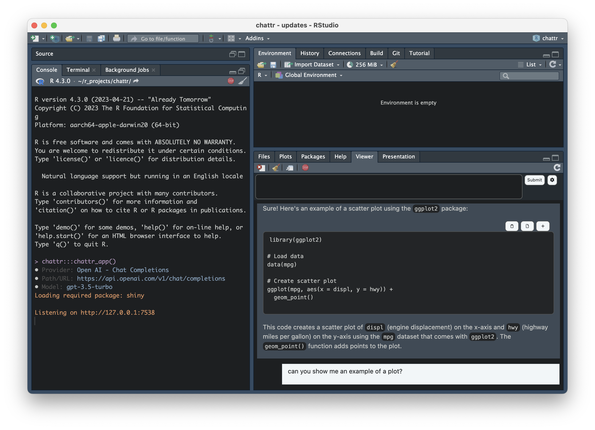

# tidychat

<!-- badges: start -->

[](https://github.com/edgararuiz/tidychat/actions/workflows/R-CMD-check.yaml)
[](https://app.codecov.io/gh/edgararuiz/tidychat?branch=main)
[](https://CRAN.R-project.org/package=tidychat)
[](https://lifecycle.r-lib.org/articles/stages.html#experimental)

<!-- badges: end -->

## Install

Since this is a very early version of the package, you can either clone
the repo, or install the package from GH:

``` r
remotes::install_github("edgararuiz/tidychat")
```

## Getting Started

### Secret key

OpenAI requires a **secret key** to authenticate your user. It is
required for any application non-OpenAI application, such as `tidychat`,
to have one in order to function. A key is a long alphanumeric sequence.
The sequence is created in the OpenAI portal. To obtain your **secret
key**, follow this link: [OpenAI API
Keys](https://platform.openai.com/account/api-keys)

By default, `tidychat` will look for the **secret key** inside the a
Environment Variable called `OPENAI_API_KEY`. Other packages that
integrate with OpenAI use the same variable name.

Use `Sys.setenv()` to set the variable. The downside of using this
method is that the variable will only be available during the current R
session:

``` r
Sys.setenv("OPENAI_API_KEY" = "####################")
```

A preferred method is to save the secret key to the `.Renviron` file.
This way, there is no need to load the environment variable every time
you start a new R session. The `.Renviron` file is available in your
home directory. Here is an example of the entry:

    OPENAI_API_KEY=####################

### Test connection

``` r
tidychat_test()
✔ Connection with OpenAI cofirmed
✔ Access to models confirmed
```

### Usage



### Use with `tidychat_app()`

``` r
tidychat::tidychat_app()
```

    Show in New Window
    • Provider: Open AI
    • Model: GPT 3.5 Turbo
    Loading required package: shiny

    Listening on http://127.0.0.1:5253

## Appendix

### How to setup the keyboard shortcut

-   Select *Tools* in the top menu, and then select *Modify Keyboard
    Shortcuts*
    

-   Search for the `tidychat` adding by writing “open chat”, in the
    search box  
    

-   To select a key combination for your shortcut, click on the Shortcut
    box and then type *press* the key combination in your keyboard. In
    my case, I chose *Ctrl+Shift+C*
    
